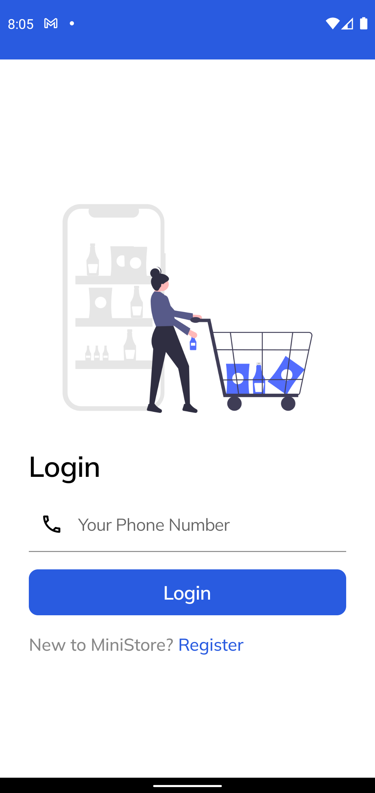
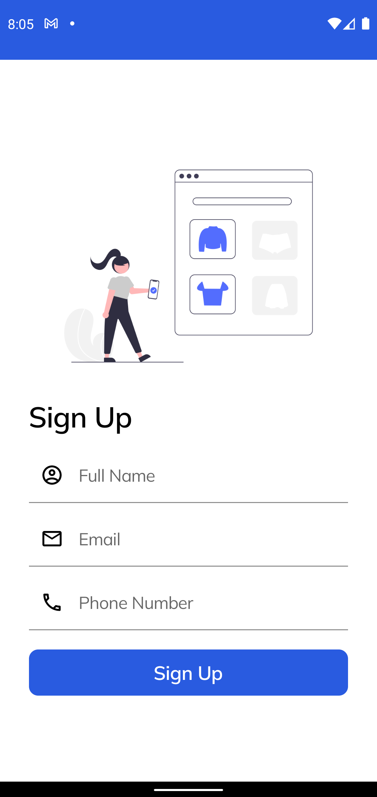
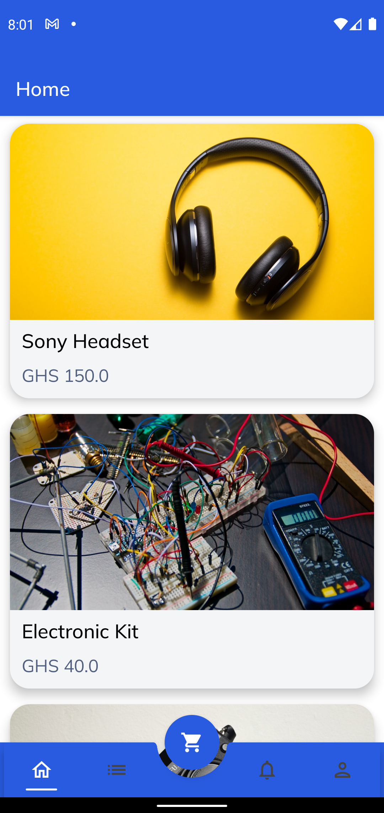
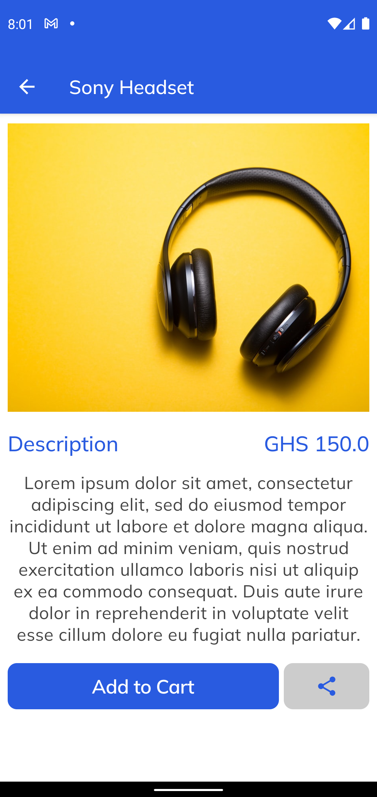
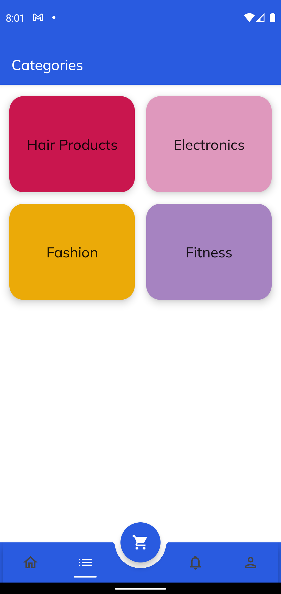
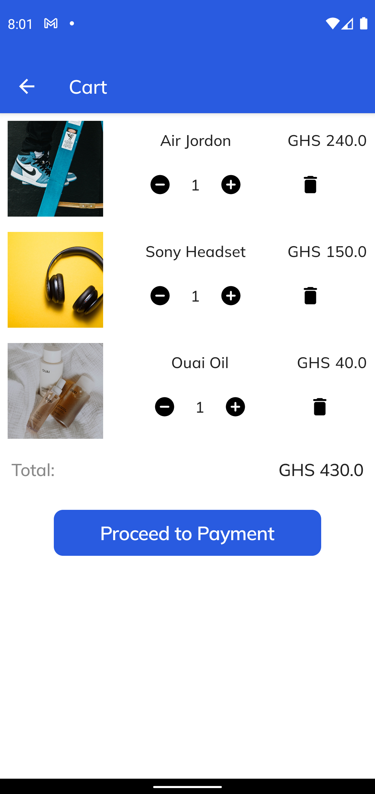
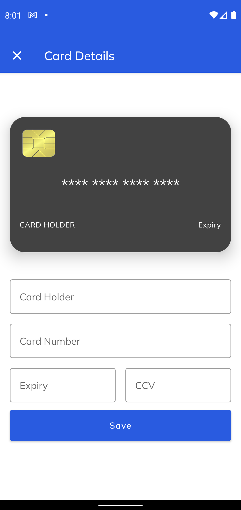

# Ministore

## Introduction
A mini e-commerce android application using Jetpack Compose

## Getting Started

This project uses Jetpack Compose for UI designs. Ministore uses a Single-Activity Architecture with MVVM pattern. Jetpack Navigation library provide navigation through the application. Hilt is used for injecting dependencies where necessary.  
The `HomeScreen` gets a list of `ProductItem`, which are grouped into `ProductCategory` provided through a `CategoryRepository` with a `HomeViewModel`. The `CategoryRepository` takes care of retreiving all the products, a single product and a single category. 
`CartViewModel` handles cart management operations.

## Screenshots
<table>
  <tr>
    <td>
      
    </td>
    <td>
      
    </td>
    <td>
      
    </td>
    <td>
      
    </td>
    <td>
      
    </td>
    <td>
      
    </td>
    <td>
      
    </td>
  </tr>
</table>

## Project Setup
1. Clone project  
2. Import into Android Studio  
3. Download project dependencies  
4. Run the application

